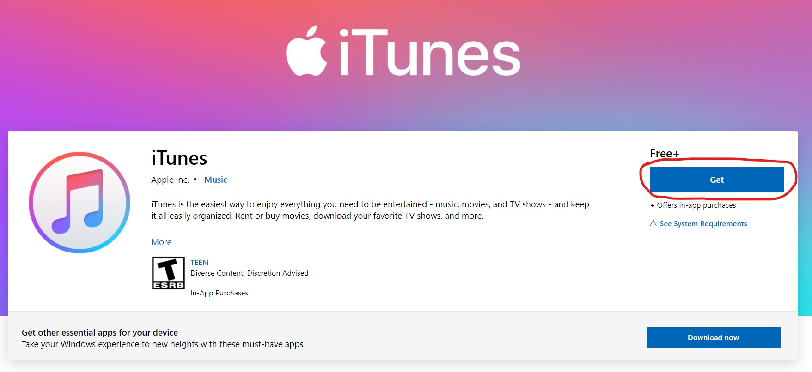
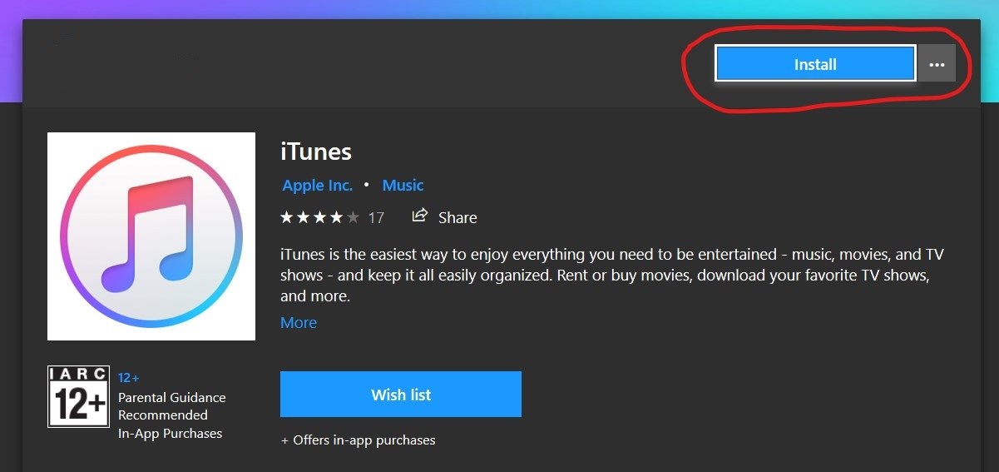
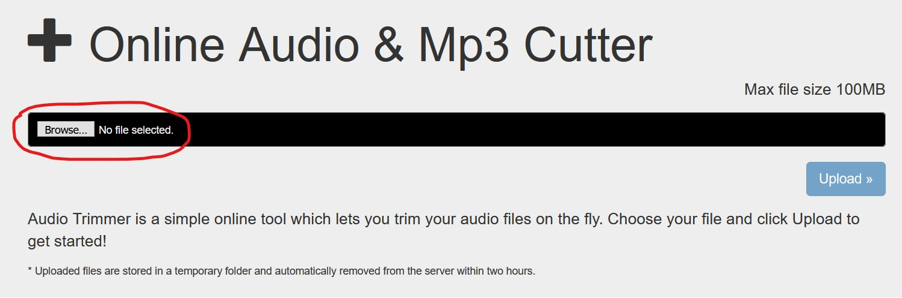
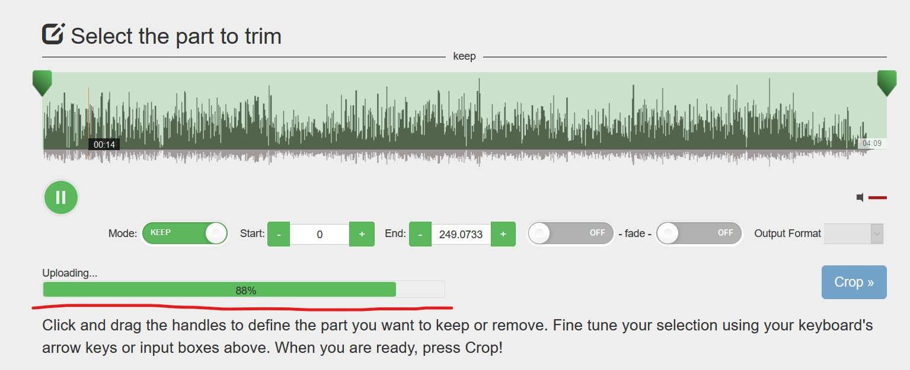
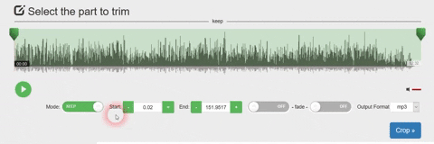
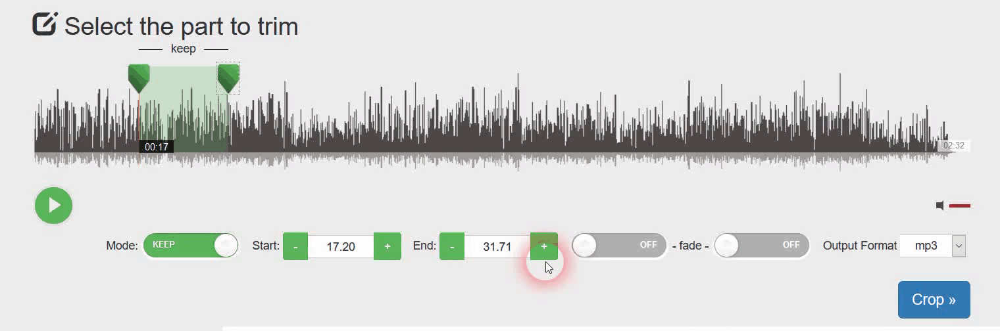
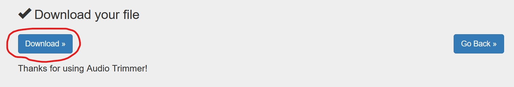

# How to Add Your Own Ringtone on an iPhone?
## You will need:
* Computer with Internet access
* The song that you want to be your ringtone

## Steps:
### **1. Install iTunes on your computer**
**If you are using Mac**: skip this step as iTunes is already installed on your device by default.
 
**If you are using Windows**: [install the latest version of iTunes](https://www.microsoft.com/en-us/p/itunes/9pb2mz1zmb1s "Install iTunes") as you see on the screenshots:
 

 
 
That button will take you to the Microsoft Store:
 

 
 
Wait for the download to finish, proceed with the installation by accepting terms & conditions and clicking "Continue" when prompted.
### **2. Choose the file for your ringtone**
iTunes **does not** let us make files longer than 40 seconds into ringtones. If your audio file is longer than 40 seconds you could use an [online audio trimmer](https://audiotrimmer.com "Online Audio Trimmer"). To upload your file click on the `Browse..` button and select your file from the explorer:
 

 
 
Wait for the file to upload:
 

 
 
### **3. Trim the file**
Move the sliders on the left and right to select the part of the audio that you want for your ringtone. You may also use the `+` and `-` buttons next to `Start` and `End` to make your cut more precise (Remember that the result has to be shorter than 40 seconds):
 

 
 
Select `m4r` from the dropdown menu next to `Output Format` and click `Crop >>`:
 

 
 
Wait for the processing to finish and download the file on your computer:
 

 
 
### **4. Connect your phone to your computer**
Open the iTunes app on your computer and using the charging cable connect your iPhone to the computer. Unlock the phone. You may receive an alert like this:
 

 
Taken from [Apple Support](https://support.apple.com/en-us/HT202778 "Apple Support")
 
 
Click `Trust` and enter your iPhone password if you get prompted to do so.
 
 
 
 
drag'n'drop the file
 
choose the ringtone from the ringtone list
 
еще можно как доп стэп показать как делать персональные рингтоны для отдельных контактов