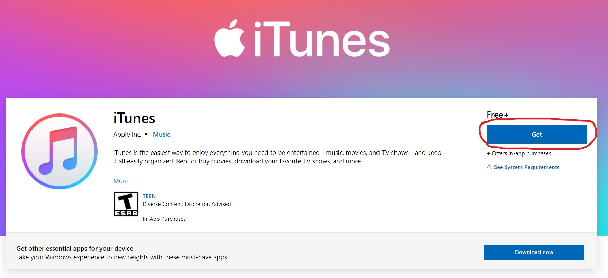
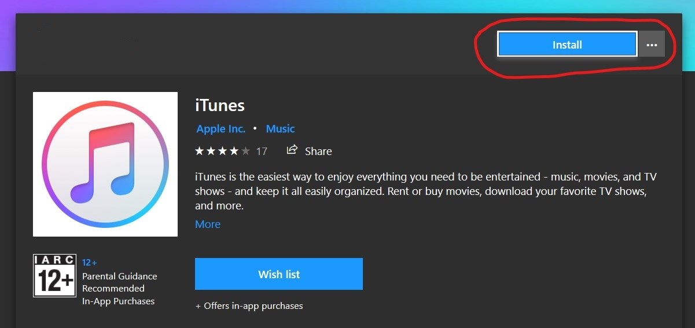
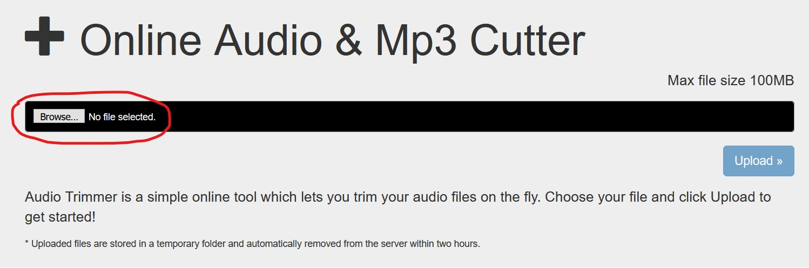
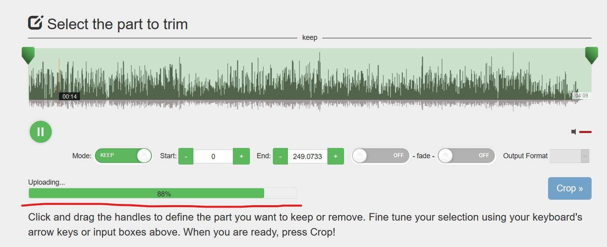
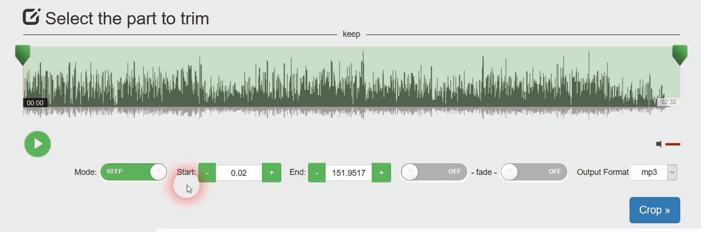
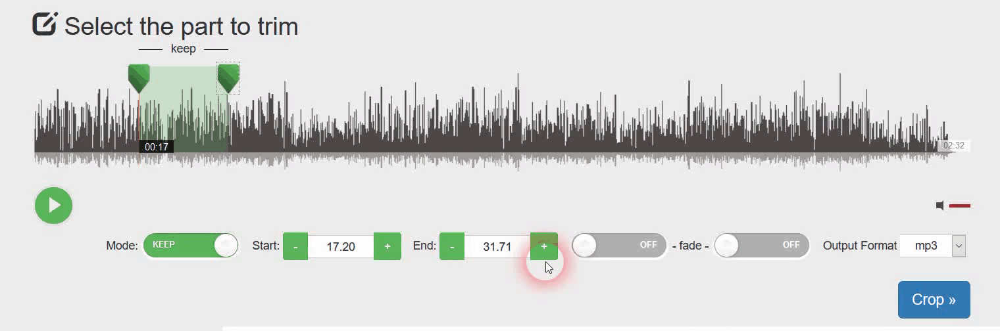
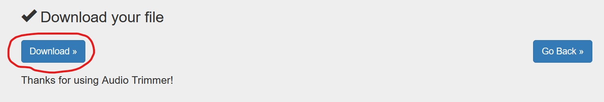
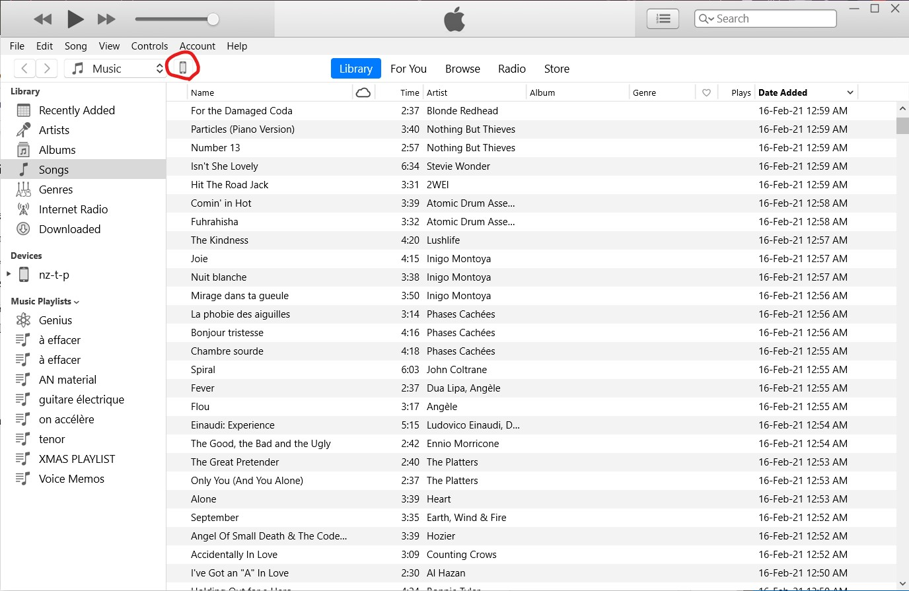
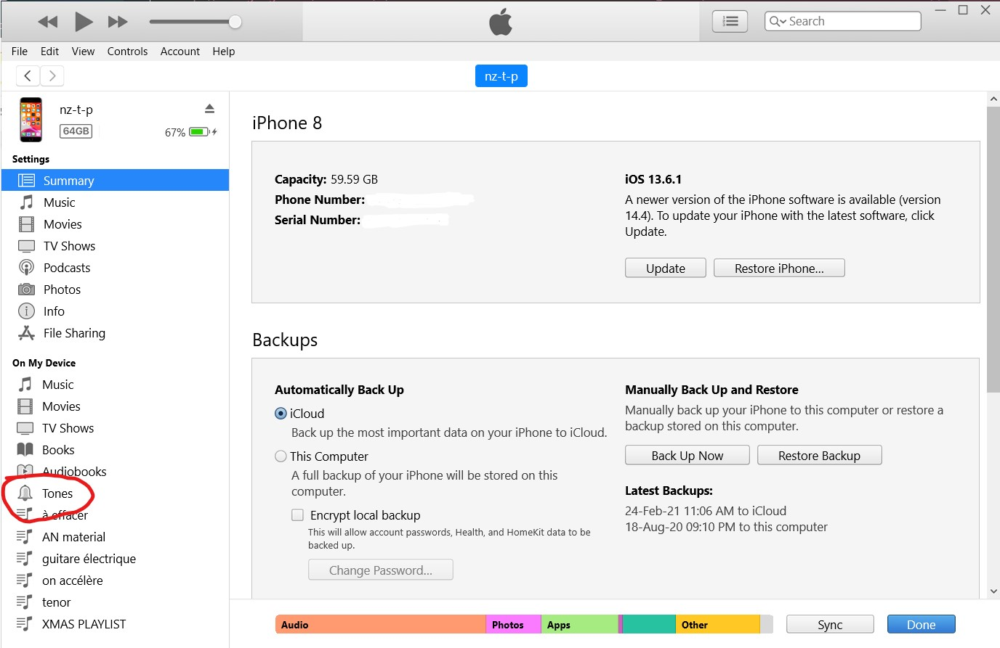

# How to Add Your Own Ringtone to an iPhone?
## You will need
* _iPhone_
* _Charging cable for your phone_
* _Computer (running Mac or Windows) with Internet access_
* _The song that you want to be your ringtone (accepted audio file types: \*.mp3, \*.wav, \*.wma, \*.ogg, \*.m4r, \*.3gpp, \*.opus, \*.m4a, \*.aac, \*.amr, \*.flac, \*.aiff, \*.ape)_

| Table of Contents |
| --- |
| [1. Install iTunes on your computer](#1-install-itunes-on-your-computer) |
| [2. Choose the audio file for your ringtone](#2-choose-the-audio-file-for-your-ringtone) |
| [3. Trim the audio and obtain the \*.m4r file](#3-trim-the-audio-and-obtain-the-m4r-file) |
| [4. Connect your phone to the computer](#4-connect-your-phone-to-the-computer) |
| [5. Upload the file to your phone](#5-upload-the-file-to-your-phone) |
| [6. Select your new ringtone in the settings](#6-select-your-new-ringtone-in-the-settings) |
| [7. _(optional)_ Assign a personal ringtone to your contacts](#7-optional-assign-a-personal-ringtone-to-your-contacts) |

## **1. Install iTunes on your computer**
**If you are using Mac**: skip this step as iTunes is already installed on your device by default.
 
**If you are using Windows**: [install the latest version of iTunes](https://www.microsoft.com/en-us/p/itunes/9pb2mz1zmb1s "Install iTunes") as you see on the screenshots:
 
 

 
 
That button will take you to the Microsoft Store:
 
 

 
 
Wait for the download to finish, proceed with the installation by accepting terms & conditions and clicking "Continue" when prompted.
 
 

## **2. Choose the audio file for your ringtone**
iTunes **does not** let us make files longer than 40 seconds into ringtones.
 
**If you already have an \*.m4r file that is shorter than 40 seconds** you may skip steps 2 and 3.
 
**Otherwise** you should use an [online audio trimmer](https://audiotrimmer.com "Online Audio Trimmer").
 
To upload your file click on the `Browse..` button and select your file from the explorer:
 
 

 
 
Wait for the upload progress bar to finish and proceed to the next step:
 
 

 
 

## **3. Trim the audio and obtain the \*.m4r file**
Move the sliders on the left and right to select the part of the audio that you want for your ringtone. You may also use the `+` and `-` buttons next to `Start` and `End` to make your cut more precise (Remember that the resulting length has to be shorter than 40 seconds):
 
 

 
 
Select `m4r` from the dropdown menu next to `Output Format` and click `Crop >>`:
 
 

 
 
Wait for the processing to finish and download the file on your computer:
 
 

 
 

## **4. Connect your phone to the computer**
Open the iTunes app on the computer and using the charging cable connect your iPhone to the computer.
 
Unlock the phone. You may receive an alert like this:
 
 

 
Taken from [Apple Support](https://support.apple.com/en-us/HT202778 "Apple Support")
 
 
Click `Trust` and enter your iPhone password if you get prompted to do so.
 
 

## **5. Upload the file to your phone**
In iTunes, click on the icon that appeared when you connected your smartphone:
 
 

 
 
Select `Tones` from the `On My Device` menu on the left side of the window:
 
 

 
 
Drag and drop your cropped audio file from the explorer to `Tones`:
 
 

 
 
After the file is uploaded you may disconnect your phone from the computer.
 
 

## **6. Select your new ringtone in the settings**
On your iPhone go to the `Settings` > `Sounds & Haptics` > `Ringtone` and select your audio file from the ringtones list.
 
 

 
 
_Congratulations! You have successfully added a customized ringtone!_
 
 

## **7. _(optional)_ Assign a personal ringtone to your contacts**
Open the `Phone` app on your phone. Open the contact page of the person you want to assign the ringtone to. Tap the `Edit` button in the top-right corner of the page. Scroll down until you see the `Ringtone` tab. Tap `Ringtone` and select the ringtone you want from the list. Tap `Done` and tap `Done` again to save your changes.
 
 

 
 